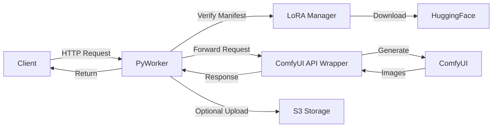

## What is PyWorker?

PyWorker is a serverless Python worker agent designed to run ComfyUI workflows on Vast.ai infrastructure. It provides a unified HTTP interface for executing any ComfyUI workflow through a proxy-based architecture, enabling scalable image and video generation on-demand.

This fork is intentionally minimal and focuses exclusively on the `comfyui-json` backend, removing unused template workers to reduce complexity and maintenance overhead.

## Key Features

<CardGroup cols={2}>
  <Card
    title="Single-Request Processing"
    icon="microchip"
  >
    Each worker handles one generation at a time with queued requests rejected immediately for optimal routing to available workers.
  </Card>
  <Card
    title="Flexible Workflows"
    icon="diagram-project"
  >
    Execute workflows using either predefined modifiers (Text2Image) or custom ComfyUI workflow JSON for complete control.
  </Card>
  <Card
    title="LoRA Management"
    icon="download"
  >
    Automatic LoRA downloading from HuggingFace with signed manifest verification and on-demand fetching.
  </Card>
  <Card
    title="S3 Integration"
    icon="cloud-arrow-up"
  >
    Built-in support for uploading generated images to S3-compatible storage (AWS S3, Cloudflare R2, Backblaze B2).
  </Card>
  <Card
    title="Health Monitoring"
    icon="heartbeat"
  >
    Provisioning markers and health check endpoints ensure workers are ready before accepting requests.
  </Card>
  <Card
    title="Workload Estimation"
    icon="gauge-high"
  >
    Intelligent workload calculation based on resolution, steps, frames, and workflow complexity for accurate cost routing.
  </Card>
</CardGroup>

## How It Works

PyWorker acts as a middleware layer between Vast.ai's serverless infrastructure and ComfyUI:

1. **Deployment**: Workers are provisioned on Vast.ai GPU instances using the provided provisioning script
2. **Request Handling**: The worker receives HTTP requests at `/generate/sync` with workflow specifications
3. **LoRA Management**: Required LoRAs are downloaded from HuggingFace and verified against signed manifests
4. **Execution**: The workflow is forwarded to the ComfyUI API wrapper running on port 18288
5. **Response**: Generated images are returned via the worker URL and optionally uploaded to S3

## Architecture



## Required Environment Variables

To deploy PyWorker on Vast.ai, configure these variables in your template:

<CodeGroup>

```bash Required Variables
BACKEND=comfyui-json
PYWORKER_REPO=https://github.com/ByQwank/pyworker
PROVISIONING_SCRIPT=https://raw.githubusercontent.com/ByQwank/pyworker/main/default.sh
HF_TOKEN=<your-huggingface-token>
PYWORKER_MANIFEST_SECRET=<shared-hmac-secret>
```

```bash Optional Variables
PYWORKER_REF=<branch|tag|commit>
SDK_BRANCH=<vast-sdk-branch>
SDK_VERSION=<vastai-sdk-version>
PYWORKER_REQUIRE_MANIFEST=auto|true|false
PYWORKER_MANIFEST_ENDPOINT=direct-instance
PYWORKER_ENABLE_BOOTSTRAP_BENCHMARK=true
```

</CodeGroup>

<Warning>
  **Security**: Never commit API keys, tokens, or secrets to your repository. Keep all credentials in Vast.ai or Trigger environment variables only.
</Warning>

## Use Cases

- **AI Image Generation Services**: Build scalable APIs for text-to-image generation
- **Video Production Pipelines**: Run image-to-video workflows with frame interpolation
- **Batch Processing**: Process large datasets with autoscaling worker pools
- **Custom ComfyUI Workflows**: Deploy specialized workflows without managing infrastructure

## Get Started

<CardGroup cols={2}>
  <Card
    title="Quickstart Guide"
    icon="rocket"
    href="/quickstart"
  >
    Get your first ComfyUI generation running in minutes
  </Card>
  <Card
    title="Vast.ai Serverless Docs"
    icon="book"
    href="https://docs.vast.ai/serverless"
  >
    Learn more about Vast.ai serverless infrastructure
  </Card>
</CardGroup>
