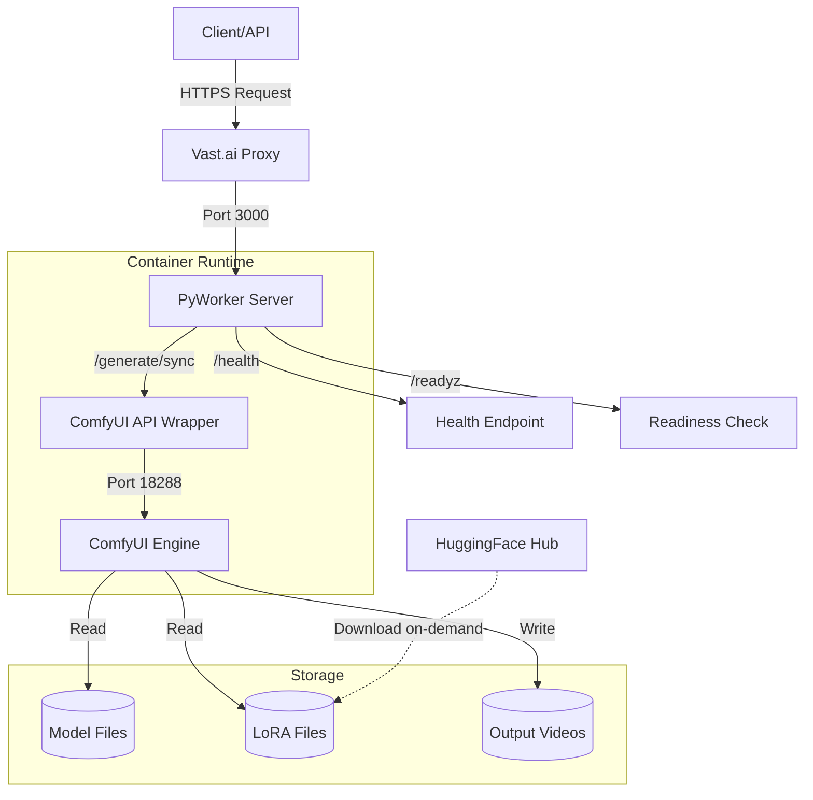

## Overview

PyWorker is a serverless Python worker agent that runs ComfyUI workloads on Vast.ai GPU infrastructure. The system bridges HTTP/JSON API requests with ComfyUI's workflow execution engine, enabling scalable image-to-video generation.

## Architecture Components

### Core Components

<CardGroup cols={3}>
  <Card title="PyWorker" icon="server">
    FastAPI-based worker handling request routing, validation, and job queueing
  </Card>
  <Card title="ComfyUI" icon="wand-magic-sparkles">
    Image/video generation engine processing workflow JSON via API wrapper
  </Card>
  <Card title="Vast.ai" icon="cloud">
    GPU infrastructure provider managing container lifecycle and networking
  </Card>
</CardGroup>

### System Architecture Diagram



## Request Flow

### Standard Generation Request

1. **Client Request** - Client sends POST to `/generate/sync` with workflow JSON
2. **Request Validation** - PyWorker validates payload structure and extracts LoRA requirements
3. **LoRA Provisioning** - Missing LoRAs downloaded from HuggingFace (with file locking)
4. **Manifest Verification** - HMAC signature validated if `PYWORKER_MANIFEST_SECRET` configured
5. **Workload Estimation** - Request analyzed to calculate processing time estimate
6. **Queue Management** - Request rejected if another job running (`MAX_QUEUE_TIME=0`)
7. **Forward to ComfyUI** - Validated payload forwarded to API wrapper at `http://127.0.0.1:18288/generate/sync`
8. **Video Generation** - ComfyUI executes workflow and returns output
9. **Response** - Result returned to client via PyWorker

<Note>
PyWorker enforces **1 worker = 1 generation** by setting `MAX_QUEUE_TIME=0.0`. This immediately rejects additional requests when a job is running, allowing clients to route to another worker.
</Note>

### Health Check Flow

**Readiness Check** (`/readyz`):
```python
# worker.py:479-501
async def readyz_remote(**params):
    # Check provisioning markers
    if PROVISIONING_FAILED_MARKER.exists():
        raise RuntimeError(f"Provisioning failed")
    if not PROVISIONING_DONE_MARKER.exists():
        raise RuntimeError(f"Provisioning not complete")
    
    # Verify ComfyUI health
    health_url = f"{MODEL_HEALTHCHECK_BASE_URL}/health"
    async with session.get(health_url) as response:
        if response.status != 200:
            raise RuntimeError(f"Model healthcheck failed")
```

The readiness check validates:
- Provisioning completed successfully (marker file present)
- ComfyUI responding to health checks
- No provisioning failure marker present

## Lifecycle Phases

### Phase 1: Provisioning

**Script**: `default.sh`  
**Duration**: 5-15 minutes (network dependent)  
**Marker**: `/workspace/.provisioning-complete`

Provisioning steps executed sequentially:

```bash
# 1. System dependencies
apt-get install aria2 rsync

# 2. Python packages
pip install huggingface_hub[hf_transfer] lark sentencepiece ...

# 3. Custom nodes (parallel clone)
git clone https://github.com/kijai/ComfyUI-WanVideoWrapper
git clone https://github.com/Kosinkadink/ComfyUI-VideoHelperSuite
# ... 11 total nodes

# 4. Model downloads (parallel via aria2c)
# ~35GB total: text encoders, VAE, diffusion models, LoRAs
aria2c -x 16 -s 16 -j 7 -k 4M ...

# 5. Verification
verify_critical_files()
touch /workspace/.provisioning-complete
```

<Warning>
If provisioning fails, `/workspace/.provisioning-failed` marker is created and PyWorker refuses to start. Check `~/workspace/debug.log` for provisioning errors.
</Warning>

### Phase 2: Server Startup

**Script**: `start_server.sh`  
**Waits for**: Provisioning marker  
**Timeout**: 2700 seconds (45 minutes)

```bash
# start_server.sh:28-68
wait_for_provisioning_completion()
# Polls PROVISIONING_DONE_MARKER every 5 seconds
# Fails immediately if PROVISIONING_FAILED_MARKER appears

# Launch PyWorker
python3 -m "workers.comfyui-json.worker"
```

Server startup sequence:
1. Wait for provisioning completion
2. Activate Python virtual environment
3. Configure SSL certificates (if `USE_SSL=true`)
4. Launch PyWorker worker.py
5. PyWorker starts ComfyUI via API wrapper
6. Health checks begin responding

### Phase 3: Runtime Operations

**Active Services**:
- PyWorker (port 3000) - Request handling and routing
- ComfyUI API Wrapper (port 18288) - Workflow execution
- ComfyUI Engine (internal) - Model inference

**On-Demand Operations**:
- LoRA downloads triggered by `ensure_lora_downloaded()` (worker.py:203-238)
- File locking prevents duplicate downloads (`fcntl.flock`)
- Downloads logged to `/var/log/portal/comfyui.log`

## Configuration Architecture

### Environment Variables

**Required**:
```bash
BACKEND=comfyui-json
CONTAINER_ID=<vast container id>
HF_TOKEN=<huggingface token>
PYWORKER_MANIFEST_SECRET=<hmac secret>
```

**Optional**:
```bash
PYWORKER_MODEL_SERVER_BASE_URL=http://127.0.0.1:18288
PYWORKER_HEALTHCHECK_BASE_URL=http://127.0.0.1:18288
PYWORKER_MODEL_HEALTHCHECK_ENDPOINT=/health
PYWORKER_READY_ROUTE=/readyz
PROVISIONING_DONE_MARKER=/workspace/.provisioning-complete
PROVISIONING_FAILED_MARKER=/workspace/.provisioning-failed
```

### Worker Configuration

```python
# worker.py:521-549
worker_config = WorkerConfig(
    model_server_url=MODEL_SERVER_URL,
    model_server_port=MODEL_SERVER_PORT,
    model_log_file=MODEL_LOG_FILE,  # /var/log/portal/comfyui.log
    model_healthcheck_url=MODEL_HEALTHCHECK_ENDPOINT,
    handlers=[
        HandlerConfig(route="/readyz", ...),
        HandlerConfig(route="/generate/sync", 
                     allow_parallel_requests=False,
                     max_queue_time=0.0,
                     request_parser=ensure_required_loras,
                     workload_calculator=workload_calculator)
    ]
)
```

## Network Architecture

### Port Mapping

| Service | Internal Port | External Access | Purpose |
|---------|--------------|-----------------|----------|
| PyWorker | 3000 | Vast.ai proxy | API requests |
| ComfyUI Wrapper | 18288 | Internal only | Workflow execution |
| ComfyUI Engine | Internal | Internal only | Model inference |

### SSL/TLS

When `USE_SSL=true`:
1. Generate CSR with OpenSSL (start_server.sh:222-253)
2. Submit CSR to `https://console.vast.ai/api/v0/sign_cert/`
3. Receive signed certificate
4. PyWorker serves HTTPS on port 3000

## Storage Architecture

### Directory Structure

```
/workspace/
├── .provisioning-complete      # Provisioning success marker
├── .provisioning-failed        # Provisioning failure marker
├── debug.log                   # Provisioning/startup logs
├── pyworker.log               # PyWorker runtime logs
├── vast-pyworker/             # PyWorker source code
└── ComfyUI/
    ├── models/
    │   ├── text_encoders/     # UMT5 text encoder (~5GB)
    │   ├── diffusion_models/  # Wan 2.2 models (~28GB)
    │   ├── vae/              # VAE model (~1GB)
    │   └── loras/            # LoRA files (on-demand)
    └── custom_nodes/         # 11 custom node repos

/var/log/portal/
└── comfyui.log               # ComfyUI execution logs
```

### File Locking

LoRA downloads use file-level locks to prevent race conditions:

```python
# worker.py:203-238
def ensure_lora_downloaded(lora_name: str):
    lock_path = COMFY_LORA_DIR / f"{lora_name}.lock"
    with open(lock_path, "w") as lock_file:
        fcntl.flock(lock_file, fcntl.LOCK_EX)  # Exclusive lock
        if target_path.exists():
            return target_path
        # Download from HuggingFace
        hf_hub_download(...)
```

## Security Architecture

### LoRA Manifest Verification

When `PYWORKER_MANIFEST_SECRET` is configured:

```python
# worker.py:144-200
def parse_and_verify_manifest(manifest):
    # Extract signed fields
    generation_id = manifest["generationId"]
    endpoint = manifest["endpoint"]
    issued_at = manifest["issuedAt"]
    required_loras = manifest["requiredLoras"]
    signature = manifest["signature"]
    
    # Verify timestamp (15 minute expiry)
    age_ms = abs(int(time.time() * 1000) - int(issued_at))
    if age_ms > MANIFEST_MAX_AGE_SECONDS * 1000:
        raise ValueError("lora_manifest signature expired")
    
    # Verify HMAC signature
    payload = canonical_json({...})
    expected = hmac.new(SECRET, payload, hashlib.sha256).hexdigest()
    if not hmac.compare_digest(expected, signature):
        raise ValueError("lora_manifest signature mismatch")
```

**Security guarantees**:
- Prevents unauthorized LoRA downloads
- Enforces client-provided LoRA allowlists
- Time-limited signatures (15 min default)
- Constant-time comparison prevents timing attacks

<Info>
Set `PYWORKER_REQUIRE_MANIFEST=auto` to automatically require signed manifests when `PYWORKER_MANIFEST_SECRET` is configured.
</Info>

## Workload Estimation

PyWorker estimates processing time based on workflow complexity:

```python
# worker.py:392-450
def estimate_workload(workflow):
    # Extract dimensions and frame count
    width = resolve_numeric_input(inputs.get("width"), workflow)
    height = resolve_numeric_input(inputs.get("height"), workflow)
    frames = resolve_numeric_input(inputs.get("length"), workflow)
    steps = resolve_numeric_input(inputs.get("steps"), workflow)
    
    # Calculate base workload
    grid_w = math.ceil(width / 512)
    grid_h = math.ceil(height / 512)
    base_workload = grid_w * grid_h * frames * steps
    
    # Apply complexity multipliers
    if has_rife: base_workload *= 1.35
    if has_upscale: base_workload *= 1.25
    if video_combine_count > 1: base_workload *= 1.15
    
    return base_workload * WORKLOAD_MULTIPLIER
```

Estimations used for:
- Request routing decisions
- Client timeout configuration
- Load balancing across workers

## Related Documentation

<CardGroup cols={2}>
  <Card title="Monitoring" icon="chart-line" href="/operations/monitoring">
    Log files, health checks, and observability
  </Card>
  <Card title="Troubleshooting" icon="wrench" href="/operations/troubleshooting">
    Common issues and debugging procedures
  </Card>
</CardGroup>