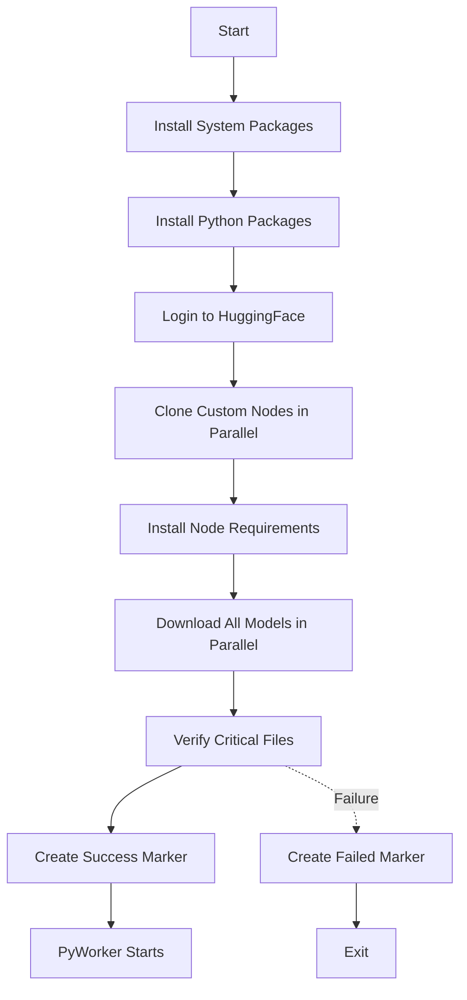

## Overview

Provisioning is the automated setup phase that runs when a new PyWorker instance starts. The `default.sh` script downloads models, installs custom nodes, and configures the environment before the worker accepts requests.

## Provisioning Flow

The provisioning process runs in sequential phases with parallel operations within each phase:



## Provisioning Script

The provisioning script is specified via the `PROVISIONING_SCRIPT` environment variable:

```bash
PROVISIONING_SCRIPT=https://raw.githubusercontent.com/ByQwank/pyworker/main/default.sh
```

### Key Environment Variables

<ParamField path="PROVISIONING_SCRIPT" type="string" required>
  Raw URL to the provisioning script.
</ParamField>

<ParamField path="WORKSPACE" type="string" default="/workspace">
  Root directory for all provisioned files.
</ParamField>

<ParamField path="HF_TOKEN" type="string" required>
  HuggingFace token for authenticated downloads.
</ParamField>

<ParamField path="PROVISIONING_DONE_MARKER" type="string" default="/workspace/.provisioning-complete">
  File created when provisioning succeeds.
</ParamField>

<ParamField path="PROVISIONING_FAILED_MARKER" type="string" default="/workspace/.provisioning-failed">
  File created when provisioning fails.
</ParamField>

## Phase 1: System Dependencies

Installs required APT packages for parallel downloads and media processing:

```bash
APT_PACKAGES=(
    "aria2"     # Parallel download manager
    "rsync"     # File synchronization
)
```

**What it does:**
- Updates APT package index
- Installs packages with `DEBIAN_FRONTEND=noninteractive` to avoid prompts
- Verifies `aria2c` is available after installation

## Phase 2: Python Packages

Installs Python dependencies required by custom nodes:

```bash
PIP_PACKAGES=(
    "huggingface_hub[hf_transfer]"  # Fast HF downloads
    "lark"                           # Parser library
    "sentencepiece"                  # Tokenization
    "opencv-python-headless"         # Computer vision
    "spandrel"                       # Model architecture
    "peft"                           # Parameter-efficient fine-tuning
    "clip_interrogator>=0.6.0"       # Image analysis
    "color-matcher"                  # Color correction
    "colorama"                       # Terminal colors
    "scipy"                          # Scientific computing
    "matplotlib"                     # Plotting
    "gguf"                           # GGUF format support
    "einops>=0.8"                    # Tensor operations
)
```

**Optimization:**
- `huggingface_hub[hf_transfer]` enables HF's fast transfer protocol
- `HF_HUB_ENABLE_HF_TRANSFER=1` is set before downloads

## Phase 3: Custom Nodes (Parallel)

Clones ComfyUI custom nodes in parallel using background processes:

```bash
NODES=(
    "https://github.com/ltdrdata/ComfyUI-Manager"
    "https://github.com/city96/ComfyUI-GGUF"
    "https://github.com/kijai/ComfyUI-WanVideoWrapper"
    "https://github.com/yolain/ComfyUI-Easy-Use"
    "https://github.com/cubiq/ComfyUI_essentials"
    "https://github.com/kijai/ComfyUI-KJNodes"
    "https://github.com/Kosinkadink/ComfyUI-VideoHelperSuite"
    "https://github.com/Fannovel16/ComfyUI-Frame-Interpolation"
    "https://github.com/SeanScripts/ComfyUI-Unload-Model"
    "https://github.com/rgthree/rgthree-comfy"
    "https://github.com/WASasquatch/was-node-suite-comfyui"
)
```

**Clone Strategy:**
- Attempts shallow clone first (`--depth 1 --single-branch`)
- Falls back to full clone if shallow clone fails
- Retries up to 3 times with exponential backoff (2s, 4s, 6s)
- All nodes cloned in parallel as background jobs
- Waits for all jobs to complete before proceeding

**Update Behavior:**
- If `AUTO_UPDATE=false`, skips updating existing nodes
- Otherwise, performs `git pull --ff-only` on existing nodes

## Phase 4: Node Requirements

Installs Python requirements for each custom node:

```bash
for node in custom_nodes/*; do
    if [[ -e $node/requirements.txt ]]; then
        pip install -r "$node/requirements.txt"
    fi
    if [[ -e $node/install.py ]]; then
        python "$node/install.py"
    fi
done
```

<Note>
  Errors during node requirement installation are logged as warnings but don't fail provisioning, allowing the process to continue even if optional dependencies fail.
</Note>

## Phase 5: Model Downloads (Parallel)

Downloads all models simultaneously using **aria2c** for maximum bandwidth utilization.

### Model Categories

#### Base Models (HuggingFace)

```bash
HF_MODELS=(
    "https://huggingface.co/Comfy-Org/Wan_2.2_ComfyUI_Repackaged/resolve/main/split_files/text_encoders/umt5_xxl_fp8_e4m3fn_scaled.safetensors|${MODELS_DIR}/text_encoders/"
    "https://huggingface.co/Comfy-Org/Wan_2.2_ComfyUI_Repackaged/resolve/main/split_files/vae/wan_2.1_vae.safetensors|${MODELS_DIR}/vae/"
    "https://huggingface.co/Comfy-Org/Wan_2.2_ComfyUI_Repackaged/resolve/main/split_files/diffusion_models/wan2.2_i2v_high_noise_14B_fp8_scaled.safetensors|${MODELS_DIR}/diffusion_models/"
    "https://huggingface.co/Comfy-Org/Wan_2.2_ComfyUI_Repackaged/resolve/main/split_files/diffusion_models/wan2.2_i2v_low_noise_14B_fp8_scaled.safetensors|${MODELS_DIR}/diffusion_models/"
)
```

#### LoRA Models (Preloaded)

```bash
LORA_MODELS=(
    "https://huggingface.co/Dylaaann/Lora/resolve/main/high_4step.safetensors"
    "https://huggingface.co/Dylaaann/Lora/resolve/main/low_4step.safetensors"
)
```

<Note>
  Only the 4-step lighting LoRAs are preloaded. Other LoRAs are downloaded on-demand by PyWorker via `ensure_lora_downloaded()` when requested in workflows.
</Note>

#### Frame Interpolation Model

```bash
RIFE_URL="https://huggingface.co/hfmaster/models-moved/resolve/.../rife/rife49.pth"
RIFE_PATH="${COMFYUI_DIR}/custom_nodes/ComfyUI-Frame-Interpolation/models/rife/rife49.pth"
```

### aria2c Configuration

The script uses aggressive parallelization optimized for high-bandwidth connections:

```bash
aria2c \
    --input-file="$aria2_input" \
    -x 16 \                              # 16 connections per server per file
    -s 16 \                              # Split each file into 16 segments
    -j 7 \                               # Download 7 files concurrently
    -k 4M \                              # 4MB minimum segment size
    --max-connection-per-server=16 \
    --file-allocation=none \             # No preallocation, start immediately
    --optimize-concurrent-downloads=true \
    --stream-piece-selector=geom \       # Prioritize completing files faster
    --uri-selector=adaptive \            # Pick fastest mirror automatically
    --disk-cache=128M \                  # 128MB buffer to reduce IO blocking
    --continue=true \                    # Resume partial downloads
    --retry-wait=3 \
    --max-tries=10 \
    --timeout=60 \
    --connect-timeout=10
```

**Why aria2c?**
- **16 connections per file**: Maximizes throughput from CDNs that allow multiple connections
- **16 segments per file**: Downloads different parts of the same file in parallel
- **7 concurrent files**: All base models (~35GB total) download simultaneously
- **4MB chunks**: Aggressive splitting for large files (10GB+)
- **No preallocation**: Starts downloading immediately instead of allocating disk space first
- **Geometric piece selection**: Completes files faster instead of downloading uniformly

**Bandwidth Optimization:**

Typical Vast.ai instance: **700-5000 Mbps** connection

- Single-threaded download: ~100 MB/s (800 Mbps)
- With aria2c: ~500 MB/s (4000 Mbps) - **5x faster**
- Total download time: **~2-3 minutes** for 35GB instead of 10-15 minutes

### HuggingFace Authentication

For HuggingFace URLs, aria2c includes the authentication header:

```bash
header="Authorization: Bearer ${HF_TOKEN}"
```

This is automatically added to the aria2c input file for HF downloads.

## Phase 6: Verification

Verifies all critical files exist before marking provisioning complete:

```bash
critical_files=(
    "${MODELS_DIR}/text_encoders/umt5_xxl_fp8_e4m3fn_scaled.safetensors"
    "${MODELS_DIR}/vae/wan_2.1_vae.safetensors"
    "${MODELS_DIR}/diffusion_models/wan2.2_i2v_high_noise_14B_fp8_scaled.safetensors"
    "${MODELS_DIR}/diffusion_models/wan2.2_i2v_low_noise_14B_fp8_scaled.safetensors"
    "$RIFE_PATH"
    "${MODELS_DIR}/loras/high_4step.safetensors"
    "${MODELS_DIR}/loras/low_4step.safetensors"
)

critical_nodes=("ComfyUI-Easy-Use" "ComfyUI-WanVideoWrapper" "ComfyUI-KJNodes" "ComfyUI-VideoHelperSuite" "ComfyUI-Frame-Interpolation")
```

**Verification Output:**
```
✓ umt5_xxl_fp8_e4m3fn_scaled.safetensors (9.8 GiB)
✓ wan_2.1_vae.safetensors (319.2 MiB)
✓ wan2.2_i2v_high_noise_14B_fp8_scaled.safetensors (12.1 GiB)
✓ wan2.2_i2v_low_noise_14B_fp8_scaled.safetensors (12.1 GiB)
✓ rife49.pth (28.4 MiB)
✓ high_4step.safetensors (142.6 MiB)
✓ low_4step.safetensors (142.6 MiB)
✓ Node: ComfyUI-Easy-Use
✓ Node: ComfyUI-WanVideoWrapper
...
```

If any critical file is missing, provisioning fails and creates `PROVISIONING_FAILED_MARKER`.

## Provisioning Markers

The provisioning script uses marker files to communicate status:

### Success Marker

```bash
PROVISIONING_DONE_MARKER="/workspace/.provisioning-complete"
```

Created when all phases complete successfully. PyWorker waits for this file before starting.

### Failure Marker

```bash
PROVISIONING_FAILED_MARKER="/workspace/.provisioning-failed"
```

Created when any phase fails. PyWorker detects this and reports an error.

### Checking Status

PyWorker's `start_server.sh` waits for provisioning:

```bash
function wait_for_provisioning_completion() {
    deadline=$(( $(date +%s) + PROVISIONING_WAIT_TIMEOUT_SECONDS ))
    
    while true; do
        if [ -f "$PROVISIONING_DONE_MARKER" ]; then
            return 0
        fi
        
        if [ -f "$PROVISIONING_FAILED_MARKER" ]; then
            report_error_and_exit "Provisioning failed"
        fi
        
        if [ "$now" -ge "$deadline" ]; then
            report_error_and_exit "Timeout waiting for provisioning"
        fi
        
        sleep $PROVISIONING_WAIT_INTERVAL_SECONDS
    done
}
```

## Skipping Provisioning

Provisioning can be skipped in several ways:

1. **No provisioning script set:**
   ```bash
   # Don't set PROVISIONING_SCRIPT
   WAIT_FOR_PROVISIONING_MARKER=auto  # Will skip
   ```

2. **Explicit skip:**
   ```bash
   WAIT_FOR_PROVISIONING_MARKER=false
   ```

3. **No-provisioning flag file:**
   ```bash
   touch /.noprovisioning
   ```

## Customizing Provisioning

To customize the provisioning process:

### 1. Fork the Repository

```bash
git clone https://github.com/ByQwank/pyworker
cd pyworker
```

### 2. Modify `default.sh`

Add your own models or custom nodes:

```bash
# Add to NODES array
NODES+=(
    "https://github.com/your-org/your-custom-node"
)

# Add to HF_MODELS array
HF_MODELS+=(
    "https://huggingface.co/your-org/your-model/resolve/main/model.safetensors|${MODELS_DIR}/checkpoints/"
)
```

### 3. Host Your Script

Commit and push changes, then use the raw URL:

```bash
PROVISIONING_SCRIPT=https://raw.githubusercontent.com/your-org/pyworker/main/default.sh
```

### 4. Pin to Commit (Recommended)

For production stability, pin to a specific commit:

```bash
PROVISIONING_SCRIPT=https://raw.githubusercontent.com/your-org/pyworker/abc123def456/default.sh
```

## Troubleshooting

### Provisioning Timeout

**Symptom:** PyWorker exits with "Timeout waiting for provisioning marker"

**Solution:** Increase the timeout:
```bash
PROVISIONING_WAIT_TIMEOUT_SECONDS=3600  # 1 hour
```

### aria2c Download Failures

**Symptom:** Some models fail to download

**Solution:**
- Check `HF_TOKEN` is valid and has access to the repository
- Verify network connectivity to HuggingFace CDN
- Look for aria2c error messages in the provisioning log
- Reduce concurrent downloads if connection is unstable:
  ```bash
  -j 3  # Instead of -j 7
  ```

### Custom Node Installation Errors

**Symptom:** Node requirements installation fails

**Solution:**
- Check the node's `requirements.txt` for version conflicts
- Install manually and verify:
  ```bash
  pip install -r /workspace/ComfyUI/custom_nodes/NodeName/requirements.txt
  ```
- Non-critical errors are logged as warnings and don't fail provisioning

### Missing Critical Files

**Symptom:** Verification phase reports missing files

**Solution:**
- Check download logs for failures
- Verify HF_TOKEN has access to the model repository
- Manually download and place in correct directory
- Re-run provisioning by deleting markers:
  ```bash
  rm /workspace/.provisioning-*
  ```

<Warning>
  Provisioning downloads **~35GB** of models. Ensure your instance has sufficient disk space (recommended: 100GB+).
</Warning>

## Performance Tips

1. **Use instances with fast network:** 1Gbps+ connections complete provisioning in 2-3 minutes
2. **SSD storage:** Faster disk I/O reduces aria2c write bottlenecks
3. **Pre-baked images:** Create a custom Vast.ai image with models pre-downloaded to skip provisioning entirely
4. **Persistent storage:** Mount `/workspace` to persistent storage to preserve downloads across instance restarts